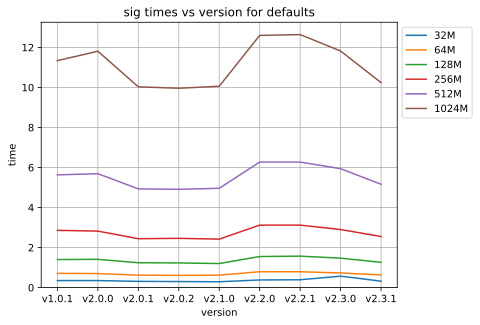
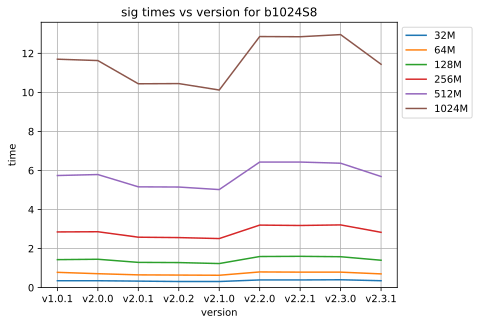
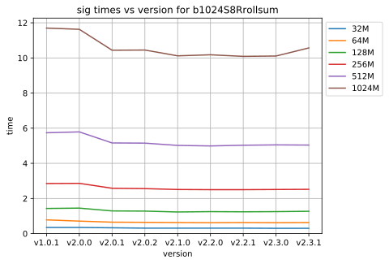

=============================
DLFUCache Performance Results
=============================

After working on librsync for some time I realized that although I'd been
doing a lot of work on performance, I didn't really know how much difference
it had made, or exactly where the bottlenecks were. I had suspicions and
generally knew from add-hock testing that things were getting better, but I
really needed decent peformance benchmarks to measure experiments against.

Testing
=======

I needed tests that measured the typical default performance, as well as tests
that highlighted the worst case bottlenecks. 

Platform
--------

I'm using a pretty crappy old `atom cpu with 4GB ram and an SSD drive
<data/platforminfo.txt>`_. This helps highlight the performance costs,
particularly the cost of cpu memory cache misses.

Data Files
----------

A variety of file sizes from 32MB to 1GB with sizes doubling and chosen to
highlight the performance sawtooth where the hastable size doubles. All files
were initially generated from /dev/urandom and then kept the same for all
tests. Each "old" and "new" file pair are the same size with a 50% mix of
unchanged/changed data, with changes in the 1st and 3rd quarter of the file.
These are not good for measuring how good the delta compression works, which
is mostly limited by the block size used, but ideal for measuring a mixture of
hits/misses.

Signature Args
--------------

I'm testing using the following variants of signature arguments:

* defaults - The default with no special arguments. Designed to measure the
  default performance.
  
* b1024S8 - Args `-b 1024 -S 8`. A 1KB blocksize with a minimal static
  signature size. Designed to highlight delta costs with smaller blocks.
  
* b1024S8Rollsum - Args `-b 1024 -S8 -R rollsum`. The same as b1024S8
  forcing the old rollsum algorithm. Used to identify any regressions
  unrelated to the new RabinKarp rollsum algorithm.
  
* S1 - Args `-S -1`. Like defaults except enabling the new `-1` minimum safe-ish
  strongsum option.

* b1024S1 - Args `-b 1024 -S -1`. Like b1024S8 except enabling the new `-1`
  minimum safe-ish strongsum option.

Versions
--------

I tested every version since v1.0.1 which is when cmake support was added. It
was easier to write scripts assuming cmake. It would have been nice to include
v0.9.7, which Debian stable still uses, and v1.0.0 which first added blake2
strongsums. Note that v1.0.1 introduced hashtable improvements that sped
things up, so the 7x delta speedups since v1.0.1 measured here are probably
even bigger when compared to the older versions that are still widely used.

Results
=======

How performance varies with version
-----------------------------------

Signatures got a bit faster with v2.0.1, which introduced a heap of changes,
but probably the better default input/output buffer sizes helped most.

Then it got even slower with v2.2.0 using the new default RabinKarp rollsum.
RabinKarp uses a multiply which does make it more expensive than the old
addition-only rollsum, but I'm surprised how much worse. The old rollsum used
an unrolled loop, but I assumed modern compiler optimizations would unroll
loops better than could be done explicitly in code.

It got a little faster with v2.3.0, which is due to the new default blocksizes
based on the filesize using larger blocks; larger blocks means fewer sums to
calculate, but you still need to calculate for every byte, so only a little
saving due to less finalization costs (which for RabinKarp include an integer
power operation using several multiplies).

But signatures are fast and cheap compared to deltas, the better RabinKarp
rollsum should give faster deltas, so the extra ~2.5secs on a 1G signature is
worth it if it can shave enough time off the delta.

Deltas got about 3.5x faster with v2.0.1, which was mostly the better
hashtable, but probably also a little bit from better default buffer sizes.

With 2.2.0, the RabinKarp rollsum made it a tiny bit faster, more than the
2.5secs cost added to the signature, but still not as much as I would have
expected, particularly given the summary stats showing the number of
strongsums calculated halved (due to less rollsum hash collisions). This made
me suspect the RabinKarp implementation had some strange inefficiencies.

Delta got 2x faster again with v2.3.0, which is entirely due to the default
blocksizes being larger for larger files.

So good news; deltas have gotten 7x faster since v1.0.1, and even v1.0.1 was
intended to be faster than the versions before that.

.. image:: data/time-vers-defaults-patch.svg

Patch got a bit cheaper at v2.0.1 because of the better input/output default
buffer sizes, and have not changed since. This is as expected, since patch
operations are completely independent of the signature used, which is were
most of the optimizations since have been. Patches are also really fast
anyway.

This shows pretty much the same thing as for defaults, except v2.3.0 doesn't
get faster if you force the blocksize. Interestingly there's nearly no
difference from the defaults, which uses a 2K blocksize, which shows the
strongsum and rollsum costs are pretty much per-byte and not per-block.

.. image:: data/time-vers-b1024S8-delta.svg

Using fixed 1K blocksize highlights the performance improvement by the new
hashtable in v2.0.1 even more; it got 5x faster. The improvement by RabinKarp
in v2.2.0 is still there but harder to see at this scale, but the match stats
show it reduced the strongsum calcs by much more than half.  Interestingly
since the new hashtable going from 2K to 1K blocks has no visible impact on
the speed, but v2.3.0's default 32K block for a 1G file does make 2x speedup.
So smaller blocks do make a difference at some point, and it turns out that
point is when the hashtable gets small enough the keys fit into the cpu's
memory cache.

The lack of significant improvements from RabinKarp still bothered me. Adding
the new rollsum meant the delta calculator needs to select the rollsum
implementation at runtime using an if-statment dispatcher. Perhaps this
dispatching added too much overheads?

Patch patch is identical to defaults, since the delta cacluated is identical.

This confirms that none of the other changes necessary to add RabinKarp
support caused a regression for signatures; v2.2.0+ using rollsum is exactly
the same as v2.1.0. This means the extra 2.5secs for a 1G file is entirely in
the RabinKarp rollsum.

.. image:: data/time-vers-b1024S8Rrollsum-delta.svg

If the runtime dispatching to the rollsum implementation was adding
significant overheads, then we should see those overheads when explicitly
using the old rollsum implementation, but we don't. Using the old rollsum
v2.2.0+ are exactly the same as v2.1.0. This means the dynamic
dispatching overheads are completely negiligable. The minimal gains with
RabinKarp are not because of other introduced overheads.

Summary
=======

Making RabinKarp Faster
-----------------------
