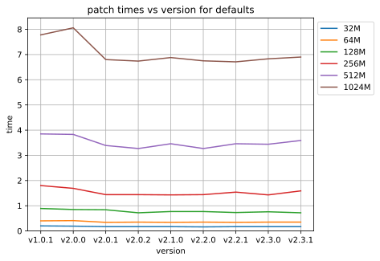

=============================
DLFUCache Performance Results
=============================

After working on librsync for some time I realized that although I'd been
doing a lot of work on performance, I didn't really know how much difference
it had made, or exactly where the bottlenecks were. I had suspicions and
generally knew from add-hock testing that things were getting better, but I
really needed decent peformance benchmarks to test against.

Testing
=======

I needed tests that measured the typical default performance, as well as tests
that highlighted the worst case bottlenecks. 

Platform
--------

I'm using a pretty crappy old `atom cpu with 4GB ram <data/platforminfo.txt`_.
This helps highlight the performance costs, particularly the cost of cpu cache
misses.

Data Files
----------

A variety of file sizes from 32MB to 1GB with sizes doubling and chosen to
highlight the performance sawtooth where the hastable size doubles. All files
were initially generated from /dev/urandom and then kept the same for all
tests. Each "old" and "new" file pair are the same size with a 50% mix of
unchanged/changed data, with changes in the 1st and 3rd quarter of the file.
These are not good for measuring how good the delta compression works, which
is mostly limited by the block size used, but ideal for measuring a mixture of
hits/misses.

Signature Args
--------------

I'm testing using the following variants of signature arguments;

  * defaults - The default with no arguments. Designed to measure the default
    performance.
    
  * b1024S8 - Args `-b 1024 -S 8`. A 1KB blocksize with a minimal static
    signature size. Designed to highlight delta costs with smaller blocks.
    
  * b1024S8Rollsum - Args `-b 1024 -S8 -R rollsum`. The same as b1024S8
    forcing the old rollsum algorithm. Used to identify any regressions
    unrelated to the new RabinKarp rollsum algorithm.
    
  * S1 - Args `-S -1`. Like defaults except enabling the new `-1` minimum safe
    strongsum option.

  * b1024S1 - Args `-b 1024 -S -1`. Like b1024S8 except enabling the new `-1`
    minimum safe strongsum option.
    

Results
=======

How performance varies with version
-----------------------------------

.. image:: data/time-vers-defaults-sig.svg

.. image:: data/time-vers-defaults-delta.svg

Summary
=======
