=============================
Librsync Performance Results
=============================

After working on librsync for some time I realized that although I'd been
doing a lot of work on performance, I didn't really know how much difference
it had made, or exactly where the bottlenecks were. I had suspicions and
generally knew from add-hock testing that things were getting better, but I
really needed decent peformance benchmarks to measure experiments against.

Testing
=======

I needed tests that measured the typical default performance, as well as tests
that highlighted the worst case bottlenecks.

Platform
--------

I'm using a pretty crappy old `atom cpu with 4GB ram and an SSD drive
<data/platforminfo.txt>`_. This helps highlight the performance costs,
particularly the cost of cpu memory cache misses.

Data Files
----------

A variety of file sizes from 32MB to 1GB with sizes doubling and chosen to
highlight the performance sawtooth where the hastable size doubles. All files
were initially generated from /dev/urandom and then kept the same for all
tests. Each "old" and "new" file pair are the same size with a 50% mix of
unchanged/changed data, with changes in the 1st and 3rd quarter of the file.
These are not good for measuring how good the delta compression works, which
is mostly limited by the block size used, but ideal for measuring a mixture of
hits/misses.

Signature Args
--------------

I'm testing using the following variants of signature arguments:

* defaults - The default with no special arguments. Designed to measure the
  default performance.

* b1024S8 - Args `-b 1024 -S 8`. A 1KB blocksize with a minimal static
  signature size. Designed to highlight delta costs with smaller blocks.

* b1024S8Rollsum - Args `-b 1024 -S8 -R rollsum`. The same as b1024S8
  forcing the old rollsum algorithm. Used to identify any regressions
  unrelated to the new RabinKarp rollsum algorithm.

* S1 - Args `-S -1`. Like defaults except enabling the new `-1` minimum safe-ish
  strongsum option.

* b1024S1 - Args `-b 1024 -S -1`. Like b1024S8 except enabling the new `-1`
  minimum safe-ish strongsum option.

Versions
--------

I tested every version since v1.0.1 which is when cmake support was added. It
was easier to write scripts assuming cmake. It would have been nice to include
v0.9.7, which Debian stable still uses, and v1.0.0 which first added blake2
strongsums. Note that v1.0.1 introduced hashtable improvements that sped
things up, so the 7x delta speedups since v1.0.1 measured here are probably
even bigger when compared to the older versions that are still widely used.

Results
=======

How performance varies with version
-----------------------------------

.. image:: data/time-vers-defaults-sig.svg

Signatures got a bit faster with v2.0.1, which introduced a heap of changes,
but probably the better default input/output buffer sizes helped most.

Then it got even slower with v2.2.0 using the new default RabinKarp rollsum.
RabinKarp uses a multiply which does make it more expensive than the old
addition-only rollsum, but I'm surprised how much worse. The old rollsum used
an unrolled loop, but I assumed modern compiler optimizations would unroll
loops better than could be done explicitly in code.

It got a little faster with v2.3.0, which is due to the new default blocksizes
based on the filesize using larger blocks; larger blocks means fewer sums to
calculate, but you still need to calculate for every byte, so only a little
saving due to less finalization costs (which for RabinKarp include an integer
power operation using several multiplies).

But signatures are fast and cheap compared to deltas, the better RabinKarp
rollsum should give faster deltas, so the extra ~2.5secs on a 1G signature is
worth it if it can shave enough time off the delta.

.. image:: data/time-vers-defaults-delta.svg

Deltas got about 3.5x faster with v2.0.1, which was mostly the better
hashtable, but probably also a little bit from better default buffer sizes.

With 2.2.0, the RabinKarp rollsum made it a tiny bit faster, more than the
2.5secs cost added to the signature, but still not as much as I would have
expected, particularly given the summary stats showing the number of
strongsums calculated halved (due to less rollsum hash collisions). This made
me suspect the RabinKarp implementation had some strange inefficiencies.

Delta got 2x faster again with v2.3.0, which is entirely due to the default
blocksizes being larger for larger files.

So good news; deltas have gotten 7x faster since v1.0.1, and even v1.0.1 was
intended to be faster than the versions before that.

.. image:: data/time-vers-defaults-patch.svg

Patch got a bit cheaper at v2.0.1 because of the better input/output default
buffer sizes, and have not changed since. This is as expected, since patch
operations are completely independent of the signature used, which is were
most of the optimizations since have been. Patches are also really fast
anyway.

.. image:: data/time-vers-b1024S8-sig.svg

This shows pretty much the same thing as for defaults, except v2.3.0 doesn't
get faster if you force the blocksize. Interestingly there's nearly no
difference from the defaults, which uses a 2K blocksize, which shows the
strongsum and rollsum costs are pretty much per-byte and not per-block.

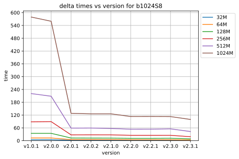

Using fixed 1K blocksize highlights the performance improvement by the new
hashtable in v2.0.1 even more; it got 5x faster. The improvement by RabinKarp
in v2.2.0 is still there but harder to see at this scale, but the match stats
show it reduced the strongsum calcs by much more than half.  Interestingly
since the new hashtable going from 2K to 1K blocks has no visible impact on
the speed, but v2.3.0's default 32K block for a 1G file does make 2x speedup.
So smaller blocks do make a difference at some point, and it turns out that
point is when the hashtable gets small enough the keys fit into the cpu's
memory cache.

The lack of significant improvements from RabinKarp still bothered me. Adding
the new rollsum meant the delta calculator needs to select the rollsum
implementation at runtime using an if-statment dispatcher. Perhaps this
dispatching added too much overheads?

.. image:: data/time-vers-b1024S8-patch.svg

Patch patch is identical to defaults, since the delta cacluated is identical.

.. image:: data/time-vers-b1024S8Rrollsum-sig.svg

This confirms that none of the other changes necessary to add RabinKarp
support caused a regression for signatures; v2.2.0+ using rollsum is exactly
the same as v2.1.0. This means the extra 2.5secs for a 1G file is entirely in
the RabinKarp rollsum.

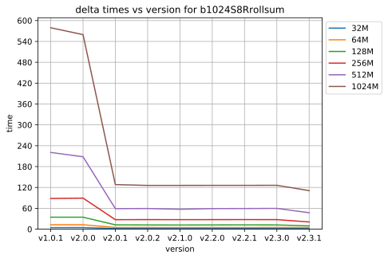

If the runtime dispatching to the rollsum implementation was adding
significant overheads, then we should see those overheads when explicitly
using the old rollsum implementation, but we don't. Using the old rollsum
v2.2.0+ are exactly the same as v2.1.0. This means the dynamic
dispatching overheads are completely negiligable. The minimal gains with
RabinKarp are not because of other introduced overheads.

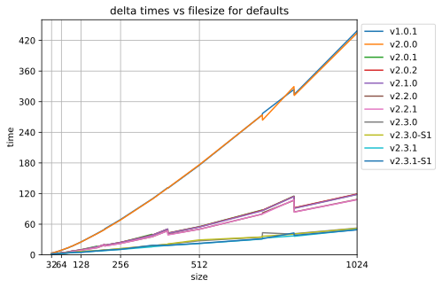

Plotting the delta execution time against filesize clearly shows the
performance saw-tooths at the point where the hashtable doubles in size. It
also shows the 2.3.0 larger default blocksize for larger files benefits
clearly, but can't show the sawtooth because the blocksizes nolonger line up
with the filesizes chosen. Interestingly the sawtooth step is small,
showing the hashtable's high 80% loadfactor is an OK compromize against
hashtable size.

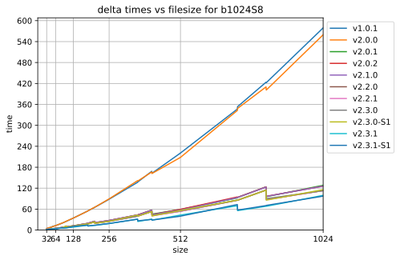

For the fixe blocksize v2.3.0 doesn't get an advantage any more, but the
benefits of the new hashtable are even more visible.

How memory vary with version
-------------------------------

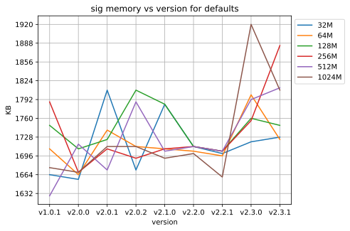

The memory required for signatures is small. It jumped a little with v2.0.1
because of the larger default input/output buffers, and again with v2.3.0
because of the larger default blocksizes for larger files.

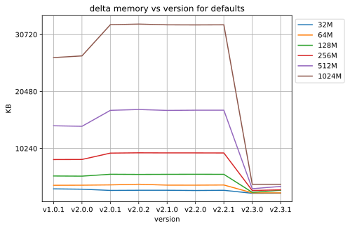

The memory required for deltas is large because it needs the full signature
and hashtable in memory. It jumped a bit with v2.0.1 with the new hashtable,
and dropped significantly with v2.3.0 with the larger default blocksizes for
large files.

The memory required for patch is very small. It jumped a tiny bit with v2.0.1
becuse of the larger default input/output buffers, but has not changed since.

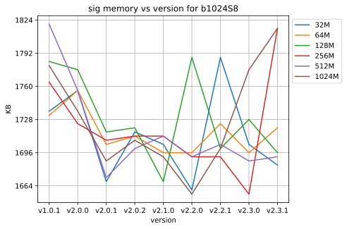

It has not changed much at all. Interestingly it has maybe dropped a tiny bit
since v2.0.1 because the input/output default buffer size became dependent on
the blocksize, and it must be a tiny bit smaller for 1K blocks than the old
default.

.. image:: data/mem-vers-b1024S8-delta.svg

It dropped with V2.0.1 dispite the new hashtable increase visible with
defaults because that version also introduced strongsum memory packing for
strongsums smaller than the default max size. The `-S 8` strongsums are
significantly smaller than the 32byte max.

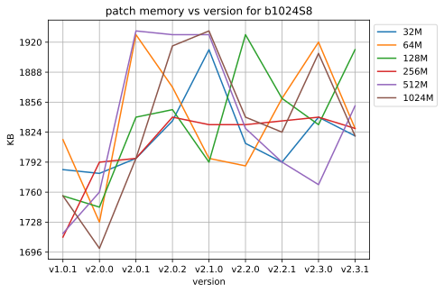

The patch memory jumped a little with v2.0.1 perhaps because the insert
command sizes got longer, resulting in larger inserts being written.

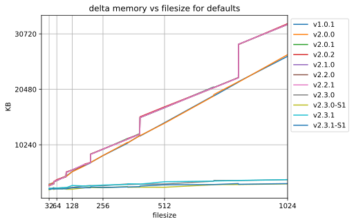

This clearly shows the saw-tooth growth vs filesize when the hashtable size
doubles for v2.0.1 -> v2.2.1. For v2.3.0 the blocksize varies with filesize so
the saw-tooth points don't align with the filesizes used and are not
visible. The memory savings of larger blocks in v2.3.0 are very clear.

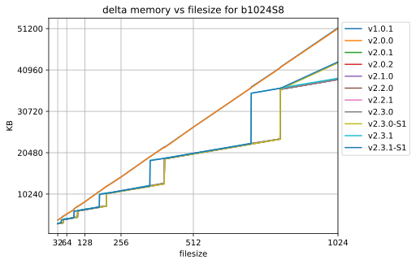

The fixed blocksize removes v2.3.0's memory advantage, but the strongsum
packing means all versions since v2.0.1 use less memory despite the larger
hashtable, even at the saw-tooth peaks.

How filesizes vary with version
-------------------------------

The signature has stayed the same until v2.3.0 when it significantly dropped
because of the larger default blocksize for larger files.

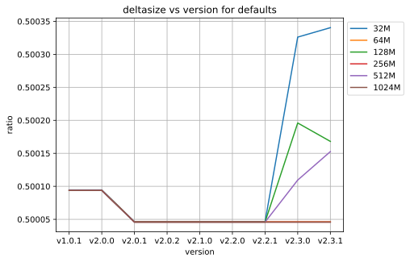

The delta dropped a little at v2.0.1 because of longer insert commands. It
jumps at v2.3.0 because the blocksizes are nolonger a nice multiple of the
deltas in our test data, meaning we have small extra insert commands at the
delta boundaries.

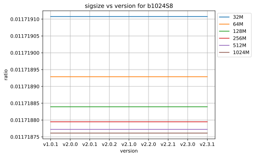

Signatures have stayed exactly the same size.

Delta's dropped a tiny bit with v2.0.1 because of longer insert commands
having less overheads.

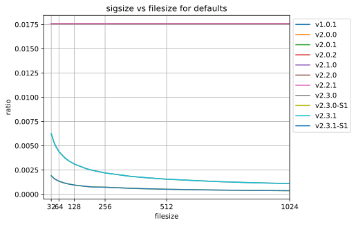

Before V2.3.0 signatures were 1.75% of the original filesize. With V2.3.0
Signatures get smaller with filesize because the blocksize used grows. When
also using '-S -1' for the minimum safe strongsum size they get even smaller,
particularly for small files.

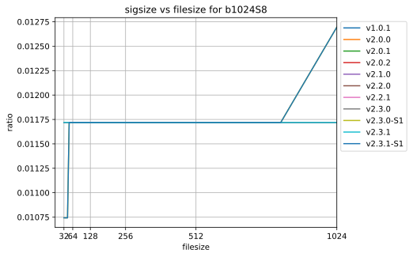

With a fixed blocksize all versions are the same. Note the vertical scale; the
variation is actually tiny, and shows amortizing the header cost over the
signature data.

Summary
=======

Making RabinKarp Faster
-----------------------

The profile runs clearly showed that RabinKarp signature generation was about
20% slower than the old Rollsum. That seemed excessive.

I first checked the assembler output using `gcc -S` and noticed it was using
`imulq` 64bit multiplies. This lead to discovering the importance of putting
`U` on the end of your large #define's and literals.

I then checked `profiling rabinkarp <data/prof_sig_b1024S8_v2.3.0.txt>`_ with
`-b 1024 -S 8` which showed it was spending nearly as much time in
rs_calc_weak_sum() calculating the RabinKarp sums as calculating the strongsum
with blake2b_compress(). Whaaat! Then I compared that to `profiling rollsum
<data/prof_sig_b1024S8Rrollsum_v2.3.0.txt>`_ which showed RabinKarp was about
2.5x as slow as Rollsum. What amazed me is how fast blake2b was. I assumed it
would be dominating the signature time and thus the RabinKarp slowdown must
have been order-of-magnitude slower than Rollsum to make a 20% overall
difference. Seeing that RabinKarp was only 2.5x slower meant there wasn't
something hugely wrong, but there was still scope for making it better.

So I started looking at the assembler generated, profiling, and manual loop
unrolling. There are several ways that RabinKarp can be unrolled which can be
summarized as mixtures of the following 2 extrems;

1. K * (K * (K * (K * hash + b[0]) + b[1]) + b[2]) + b[3]

2. K^4 * hash + K^3 * b[0] + K^2 * b[1] + K * b[2] + b[3]

The first is just a literal expansion of how the iterative loop evalutes it.
It has the disadvantage that each multiply needs the result of the inner
multiply and add, so it has to be executed sequentially.

The second is what you get when you expand the first out. The different powers
of K can be precomputed, so it's exactly the same number of multiplies and ads
as the first, but all the multiplies don't depend on each other so can be
parallelized on CPU's that can do that.

In practice the following mixed approach benchmarked the fastest, by quite a
bit, but I don't fully understand why;

3. (K^2 * (K^2 * hash + K * b[1] + b[0]) + K * b[2] + b[3])

I expanded it out to do 2 parallel mults 4x for 16 bytes at once. I also
experimented with unit32_t vs uint_fast32_t and strangely the fast32 variant
meant that it used 64bit multiplies for some (not all) of the multiplies and
was slower. I also experimented with unrolling it as statements that
accumulate into the hash vs a single long expression and the expression was
faster.

Given that 2.is basically 4 32bit multiplies in parallel, I thought that
perhaps using xmm vectors would make this faster. Unfortunalty it took more
than 2x as long as my unrolled loop.

In the end I managed to shave 1.5 seconds off the 12.5 seconds for the 1G data
file. `Profiling of opt/rabinkarp1 sig
<data/prof_sig_b1024S8_opt-rabinkarp1.txt>`_ shows it is nearly 2x as fast as
blake2b now and only 1.7x slower than the old rollsum.

Lessons Learned
---------------

* blake2b is FAST! Profiling shows it costs about 2.0x RabinKarp's 32bit
  mult+add per byte. For a cryptographic hash that seems astounding. It shows
  how using blocks and 64bit operations on more than one byte at a time speed
  things up, unfortunately not something a byte-by-byte rolling sum can do.
  Also, it doesn't use any multiplies...

* Multiplies are still expensive. RabinKarp uses one multiply and one add per
  byte compared to two adds for the old Rollsum and it is 70% slower.

* Always make unsigned #define's and literals unsigned! That `U` on the end
  can be the difference between 32bit and 64bit operations.

* Compiler loop unrolling/optimizing and the automatic detection/use of vector
  MMX/SSE instructions is not great for both gcc and clang. I assumed the
  compiler would produce fast binaries best for the simplest code, but manual
  unrolling made a measurable difference. To be fair, the manual unrolling
  required testing multiple variants with significantly different results
  before finding something that worked well. The code structures that
  did/didn't trigger use of SSE instructions seemed almost random. Changing a
  value in a const static array from 0x1 to something else was enough to
  trigger it (the optimizer seemed to optimize away the `*1` before looking
  for vectoring). Also to be fair, the SSE2 vector instructions didn't make it
  faster, at least not on my crappy platform.

* Memory locality matters, a lot! The reason RabinKarp improvements didn't
  make a significant difference is the delta time is completely dominated by
  L2 cache misses just looking up the hashtable. This is why the v2.0.1 new
  hashtable made such a difference (better hash-key locality for lookups), and
  why the v2.3.0 default larger blocksize for large files made a difference
  (it needs a smaller hashtable).

Making Hashtable faster
-----------------------

The `profiling <data/prof_delta_b1024S8_v2.3.0.txt>`_ clearly shows
that hashtable lookups thrashing the L2 cache are the biggest part of delta
execution time. On the low-end atom platform I'm using we have;

* L1 cache 32K ~1ns    256K entries at 1bit/entry, 8K entries at 32bits/entry.
* L2 cache 512K 10ns   4M entries at 1bit/entry, 128K entries at 32bits/entry.
* Memory 2G+ 100ns

It's also important that the cache uses 64 byte cache lines, which can contain
16 32bit key hash values. The hashtable probing for an entry will probe at
offsets 0, 1, 3, 6, 10, 15, etc. This means after the first hashtable probe,
we get the next average 3, upto 5, probes "for free" before we need to hit the
next cache line. This is why packing the hash keys separately from the entry
pointers was such a performance win. Note that hashtable load of 80% means
typically 5 probes per lookup, whereas 70% is 3.33 probes.

My first thought was that the hash key index could be sliced up bitwise for
better locality. Slicing the keys into bitmaps with 1bit/entry means each bit
check has a 50% chance of aborting the search early before even touching the
rest of the key table. To abort misses before having to probe all the bits
requires adding a bitmap that indicates if entries are empty. The initial
"emtpy" check would only save lookups at a rate that depends on the hashtable
load (currently max 80%, so only 20% chance of aborting the lookup).
Unfortunatly, although this gives better locality across searches, it
completely destroys the locality within searches, with each bit check being on
a different cache line. The 512K L2 cache only gives us ~2bits per entry for a
2M entries hashtable, which means all bit lookups after the first 2 bits will
be hitting main memory.

After doing some modeling, and thinking about how to make bloom filters with
k<1 work (see http://minkirri.apana.org.au/wiki/PartialKBloomFilter), I came
to the conclusiong that a simple K=1 bloom filter the same size as the
hashtable is best. It should fit within L2 caches for even 4M entry hashtables
on atom-class CPU's and halve the lookup rate.

Bloomfilters with k=1 have an optimal loadfactor of ln(2)~=0.7 which is the
upper end for the hashtable. At the lower 0.35 end for the hashtable k=2 would
be better, but modeling suggests the cost of an extra bloom-filter lookup is
more than it saves in hashtable lookups. We could perhaps size the bloom
filter independently of the hashtable to better fit k=1 and save a little
memory, but it also would cost a little performance and doesn't seem worth it.

After adding a simple k=1 bloomfilter and changing the loadfactor limit to 70%
the profiling `with bloom filter
<data/prof_delta_b1024S8_opt-hashtable2.txt>`_ compared to `without bloom
filter <data/prof_delta_b1024S8_opt-rabinkarp1.txt>`_ shows we've
significantly improved the lookup time, dropping it from 93secs to 75secs.
